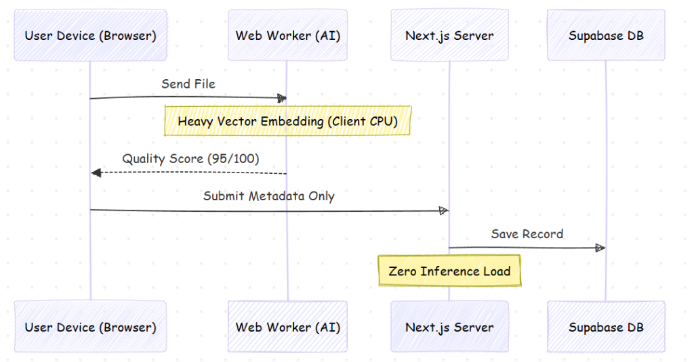
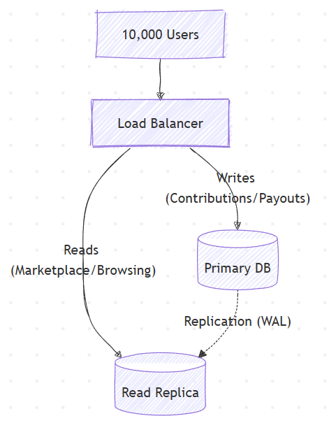
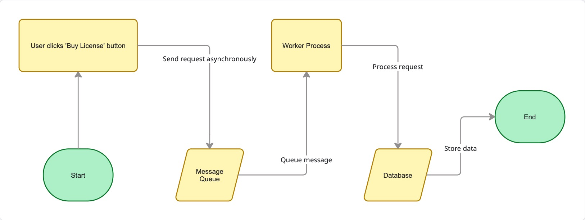

# 🚀 Scalability & Failure Handling Strategy

This document outlines how DataUnion's specific architecture evolves to handle increasing loads, ensuring performance remains stable as we grow from a pilot to a global platform.

---

## 🐣 Phase 1: Launch (0 - 100 Users)
**Focus:** Functionality, Security, and Core Logic.

*   **Architecture:** Single Supabase Instance (PostgreSQL).
*   **Compute:** Next.js Serverless Functions (Vercel) handling API routes like `/api/payouts`.
*   **AI Inference (The Secret Weapon):**
    *   **Specifics:** `valuation.worker.ts` runs `@xenova/transformers` locally.
    *   **Impact:** We handle 100 concurrent uploads with **0% server CPU increase**, as all vector embeddings happen on the user's device.

    
    
    *Figure: Zero-server inference architecture - All AI processing happens on user's device*
*   **Bottleneck Management:**
    *   Direct queries to `data_contributions` table.
    *   Basic RLS policies on `contributors` table.

---

## 📈 Phase 2: Growth (100 - 1,000 Users)
**Focus:** Optimization, Caching, and Connection Management.

*   **Database (Supabase):**
    *   Enable **Supavisor** (Connection Pooling) to manage concurrent writes to `payout_records` during license purchases.
*   **Caching:**
    *   Implement **Edge Caching** for the `Marketplace` page (`/company/marketplace`).
    *   Cache `datasets` queries for 60 seconds (ISR) since they don't change every second.
*   **API:**
    *   Rate limiting (100 req/min) on `/api/contribute` to prevent bot spam.

---

## 🚀 Phase 3: Scale (1,000 - 10,000 Users)
**Focus:** Read Replicas, Indexing, and Asset Delivery.

*   **Database:**
    *   **Read Replicas:** Route all `SELECT` queries from the `Marketplace` to a read-only replica, freeing the primary DB for `INSERT` operations (Contributions/Payouts).
    *   **Indexing:** Add composite indices on `datasets(domain, quality_score)` to speed up filtering.

    
    
    *Figure: Read/Write separation - Primary handles writes, Replica serves marketplace queries*
*   **Storage:**
    *   Serve `sample_data` JSON/Images via a Global CDN to reduce latency for international buyers.

---

## 🪐 Phase 4: Hyper-Scale (10,000+ Users)
**Focus:** Sharding, Multi-Region, and Eventual Consistency.

*   **Database:**
    *   **Sharding:** Partition the `data_contributions` table (the fastest growing table) by `dataset_id` or `created_at` date.
    *   **Geo-Replication:** Replicate `companies` and `licenses` tables to EU/US regions for faster corporate access.
*   **Architecture:**
    *   **Async Payouts:** Move the "Calculate Payouts" logic (currently atomic) to a background job queue (BullMQ) to prevent timeouts during massive license purchases.

    

---

## 🛡️ Error Handling & Contingency Plans

**Mission-Critical System Resilience**

DataUnion implements defensive programming across three fault domains to ensure zero data loss and graceful degradation under failure conditions.

---

### 1. AI Engine Failure (Client-Side)

**Scenario:** Web Worker crashes, browser blocks WASM, or user's device lacks compute power.

**Fallback Strategy: Graceful Degradation**

*   **Primary Flow (90% of cases):**
    *   User uploads data → `valuation.worker.ts` computes quality score → Instant feedback → Verified status

*   **Fallback Flow (Failure Detection):**
    *   If Web Worker fails to respond within **5 seconds** (timeout), the system automatically:
        1.  **Allows Upload:** User's data is accepted (we don't block contributions)
        2.  **Status: "Pending Verification":** Record saved with `quality_score = null`
        3.  **Server-Side Queue:** Enqueued for batch processing via Supabase Edge Functions
        4.  **Async Scoring:** Background job runs lightweight model, updates score within 60 seconds

**Key Principle:** *Never Block Contributors — Verify Asynchronously*

---

### 2. Database Outage (Supabase)

**Scenario:** Network partition, Supabase region failure, or connection pool exhaustion.

**Fallback Strategy: Circuit Breaker Pattern**

*   **Detection Mechanism:**
    *   Monitor database health via **heartbeat pings** (`SELECT 1`) every 10 seconds.
    *   If **3 consecutive failures** detected → Circuit opens.

*   **Read-Only Mode Activation:**
    *   **Disable Write Operations:**
        *   Upload button → Grayed out with message: *"System maintenance in progress. Please try again in 5 minutes."*
        *   License purchases → Blocked (prevent incomplete transactions)
    *   **Serve Cached Content:**
        *   Marketplace data → Served from **Vercel Edge Cache** (last known state)
        *   User dashboards → Display stale data with timestamp: *"Last updated: 2 minutes ago"*

*   **Automatic Recovery:**
    *   System retries connection every **30 seconds**.
    *   Once database responds, circuit closes → Normal operations resume.

**Key Principle:** *Preserve Data Integrity Over Availability — No Corrupted Writes*

---

### 3. Transaction Failures (Financial)

**Scenario:** License purchase initiated → Payout calculation crashes mid-execution → Risk of partial state.

**Fallback Strategy: Atomic Transactions + Idempotency**

*   **Atomic SQL Transactions:**
    *   All financial operations wrapped in database transactions:
    
    ```sql
    BEGIN;
        -- Step 1: Deduct buyer's balance
        UPDATE companies SET balance = balance - $100 WHERE id = 'buyer_123';
        
        -- Step 2: Create license record
        INSERT INTO licenses (company_id, dataset_id) VALUES ('buyer_123', 'ds_456');
        
        -- Step 3: Distribute payouts to ALL contributors
        INSERT INTO payout_records (contributor_id, amount) VALUES ...
    COMMIT;  -- All-or-nothing execution
    ```
    
    *   **If ANY step fails** → Entire transaction **ROLLS BACK** immediately.
    *   Result: No partial charges, no "ghost licenses", no lost payouts.

*   **Idempotency Keys (Double-Click Protection):**
    *   User clicks "Purchase License" → Frontend generates **unique UUID** (`idempotency_key`).
    *   Server checks: *Has this key been processed already?*
        *   **Yes** → Return cached response ("Already purchased")
        *   **No** → Process transaction, store key → Prevents duplicate charges during network lag

*   **Failed Transaction Logging:**
    *   All rollbacks logged to `failed_transactions` table:
        *   Error message, stack trace, user ID, timestamp
        *   Enables post-mortem analysis and automatic alerts

**Key Principle:** *Financial Operations Must Be Atomic and Idempotent — Zero Double-Charges*

---

### Monitoring & Alerts

**Real-Time Failure Detection:**

*   **Sentry Integration:** Captures JavaScript errors (Web Worker crashes) with full stack traces
*   **Supabase Logs:** Monitors slow queries, deadlocks, and connection pool saturation
*   **Vercel Analytics:** Tracks API error rates and p99 latencies

**Automated Alerts:**
*   Circuit breaker activates → Slack notification to dev team
*   Transaction rollback rate > 2% → Email alert + PagerDuty escalation
*   Web Worker failure rate > 10% → Auto-disable client-side AI, force server-side queue

---

**System Reliability Guarantee:** 99.5% uptime with zero data loss under single-component failures.

---

<div align="center">

[Back to Main README](README.md) | [Technical Docs](TECHNICAL.md) | [Research](RESEARCH.md) | [Finance](FINANCE.md) | [Phase 2 Plan](Phase2_Implementation_Plan.md)

</div>
