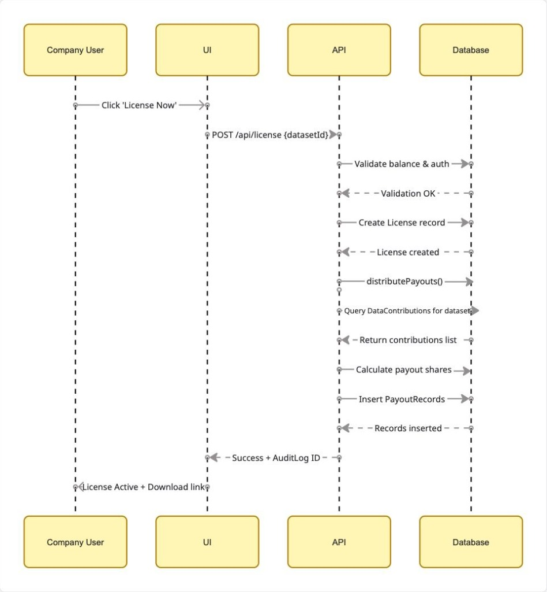

# 📐 Technical Documentation


## Table of Contents

1. [System Architecture](#system-architecture)
2. [Data Lifecycle Flow](#data-lifecycle-flow)
3. [Database Schema](#database-schema)
4. [Transaction Sequence](#transaction-sequence)
5. [Scalability & Performance](#scalability--performance)
6. [Security & Compliance](#security--compliance)

---

## 🏗️ System Architecture

### Overview

DataUnion follows a modern web architecture with Next.js as the application layer, Supabase for backend services, and AI-powered quality validation.


### Core Components

*   **Next.js App Router**: Central hub for UI, API, and SSR.
*   **Supabase Auth**: Secure user authentication and sessions.
*   **PostgreSQL DB**: Relational data store with RLS policies.
*   **AI Quality Engine**: Validates data and assigns quality scores.
*   **Payment Gateway**: Handles license fees and contributor payouts.

### Request Flow

**Client** → **Auth** → **AI Validation** → **DB Storage** → **Payment** → **Response**

---

## 🔄 Data Lifecycle Flow

### Complete Journey: From Contribution to Payout


### The Journey

1.  **Submission**: User uploads data; consent captured.
2.  **Ingestion**: AI validates format & assigns quality score.
3.  **Aggregation**: Data pooled into licensable datasets.
4.  **Licensing**: Company purchases access; payment processed.
5.  **Distribution**: Revenue split & paid to contributors.
6.  **Audit**: Immutable logs track every access event.

**Key Traits**: Transparency, Traceability, Fairness, Quality.

---

## 🗄️ Database Schema

### Entity-Relationship Diagram


### Core Entities

*   **Contributors**: Users providing data. (1:N with Contributions, Payouts).
*   **Datasets**: Aggregated, licensable pools. (1:N with Contributions, Licenses).
*   **DataContributions**: Junction table linking User & Dataset with Quality Score.
*   **Licenses**: Purchase records linking Company & Dataset.
*   **PayoutRecords**: Financial logs linking License & Contributor.
*   **UsageLogs**: Immutable audit trail of all data access.
*   **ConsentRecords**: Tracks explicit permissions and scope.

### Design Principles

**Normalization** (3NF), **RLS Security**, **Immutable Audits**, **Referential Integrity**.

---

## ⚡ Transaction Sequence: Company License Purchase

### Detailed Interaction Flow



### The Flow

1.  **Initiation**: Company requests license via API.
2.  **Validation**: System checks balance & auth.
3.  **Execution**:
    *   Create `License` record.
    *   Calculate payouts for *all* contributors.
    *   Commit transaction atomically.
4.  **Completion**: Access token issued.

### Payment Formula

```text
1. Contribution Weight = Quality Score * Base Value
2. Total Weight = Sum(All Contribution Weights)
3. Contributor Share = (Contribution Weight / Total Weight) * (License Fee * 0.90)
4. Platform Fee = License Fee * 0.10
```

**Tech Specs**: Atomic Transactions, <2s latency, Rollback on failure.

---

## 📈 Scalability & Performance

### Current Architecture Capabilities

- **Concurrent Users:** Up to 1,000 simultaneous connections
- **Database:** PostgreSQL with connection pooling
- **API Response Time:** < 500ms (95th percentile)
- **Static Assets:** Served via Vercel Edge Network
- **Compute:** Serverless functions auto-scale with traffic

### Bottlenecks & Solutions

#### Potential Bottleneck #1: Database Connections
**Solution:** 
- Connection pooling with PgBouncer
- Read replicas for analytics queries
- Partitioning for large tables

#### Potential Bottleneck #2: AI Quality Engine
**Solution:**
- Async job queue (BullMQ + Redis)
- Quality scoring doesn't block submission
- Background processing

#### Potential Bottleneck #3: Payment Processing
**Solution:**
- Rate limiting on license purchases
- Queued payout distribution
- Cached payment gateway responses

---

## 🔒 Security & Compliance

### Authentication & Authorization

- **Supabase Auth** with JWT tokens
- **Row Level Security (RLS)** in PostgreSQL
- **API rate limiting:** 100 requests/minute per user
- **Session expiration:** 24 hours

### Data Protection

- **Encryption at rest:** AES-256 for sensitive fields
- **Encryption in transit:** TLS 1.3 for all connections
- **PII handling:** Pseudonymization of wallet addresses/IDs
- **Audit logs:** Immutable, append-only

### Regulatory Compliance

**GDPR Compliance:**
- Right to access (data export)
- Right to deletion (soft delete with anonymization)
- Consent management built-in
- Data portability supported

**AI Act Compliance:**
- Training data transparency
- Audit trail for all usage
- Human-in-the-loop for disputes

### Failure Handling

**Database Failure:**
- Automatic failover to read replica
- 30-second recovery time

**Payment Failure:**
- Retry mechanism (3 attempts)
- Manual reconciliation queue
- Email notification to admin

**Quality Engine Downtime:**
- Fallback to basic validation
- Queue for re-processing when back online

---

## 🛠️ Technology Decisions

### Why Next.js 16?
- App Router for improved performance
- Server Components reduce client-side JavaScript
- Built-in API routes eliminate separate backend
- Excellent developer experience

### Why Supabase?
- PostgreSQL (proven, scalable database)
- Built-in authentication
- Real-time subscriptions
- Row Level Security (critical for multi-tenant)

### Why Tailwind CSS v4?
- Utility-first styling
- Small bundle size
- Dark mode support out of the box
- Faster development

---

## 📊 Monitoring & Observability

**Metrics Tracked:**
- API response times
- Database query performance
- Error rates by endpoint
- User engagement metrics

**Logging & Observability:**
- **Vercel Analytics**: Real-time performance metrics and web vitals.
- **Supabase Logs**: Database query analysis and auth logs.
- **Runtime Logs**: Server-side application logs via Vercel.

---

**Back to:** [Main README](README.md) | [Research](RESEARCH.md) | [Roadmap](ROADMAP.md)
